<div align="center">
  <a href="#" target="_blank">
    
  </a>
</div>

<h1 align="center">
  
</h1>

<p align="center">
  
  
</p>

<p align="center">
  💻 A passionate <strong>Web Developer</strong> from 🇻🇳 <strong>Vietnam</strong>
</p>

---

## 🚀 About Me

```javascript
const phucDT = {
  location: "Vietnam 🇻🇳",
  currentWork: "Pago Solution",
  currentLearning: ["Next.js", "TypeScript", "System Design"],
  expertise: ["React", "React Native", "Tailwind CSS", "Nodejs"],
  hobbies: ["Coding", "Reading Tech Blogs", "Building Side Projects"],
  contact: "phucdt.work@gmail.com",
};
```

## 🔭 Current Focus

- 🏢 Working at **[Pago Solution](https://www.facebook.com/PagoSolution.vn)**
- 🌱 Learning **Next.js** & **Advanced React Patterns**
- 💡 Building scalable web applications
- 📱 Developing cross-platform mobile apps

## 💼 Tech Stack

### Frontend

<p align="left">
  
  
  
  
  
  
  
  
  
  
</p>

### Backend & Database

<p align="left">
  
  
  
  
  
</p>

### Tools & Others

<p align="left">
  
  
  
  
</p>

## 📫 Connect With Me
<p align="center">
<a href="https://mail.google.com/mail/?view=cm&fs=1&to=phucdt.work@gmail.com" target="_blank"  rel="noopener noreferrer">
  
</a>
  <a href="https://drive.google.com/file/d/15FJ1-eCxZf2fULI5W9zlyVVrCEOGU09Y/view?usp=sharing" target="_blank"  rel="noopener noreferrer">
    
  </a>
  <a href="https://my-portfolio-tan-seven-70.vercel.app/?fbclid=IwY2xjawOOD3tleHRuA2FlbQIxMABicmlkETFEaHpodnlWWm81eXlBM1hOc3J0YwZhcHBfaWQQMjIyMDM5MTc4ODIwMDg5MgABHnfC4bIV8EqmusKHEYqa-j01NiTWy_r-jpNIDaa7dgENv-YsvGkW52PCCg_O_aem_2RfvJ0RcgJTGksh_9GY34w" target="_blank"  rel="noopener noreferrer">
    
  </a>
  <a href="https://github.com/phucdtWork" target="_blank"  rel="noopener noreferrer">
    
  </a>
</p>

---

<div align="center">
  
</div>

<div align="center">
  
  ### 💭 Quote of the Day
  
  *"Code is like humor. When you have to explain it, it's bad."* – Cory House
  
  ---
  
  
  
</div>
